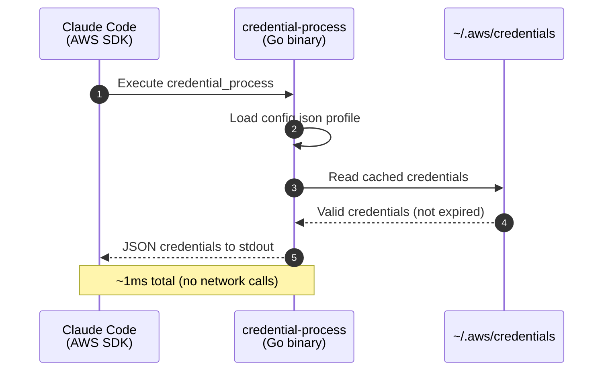
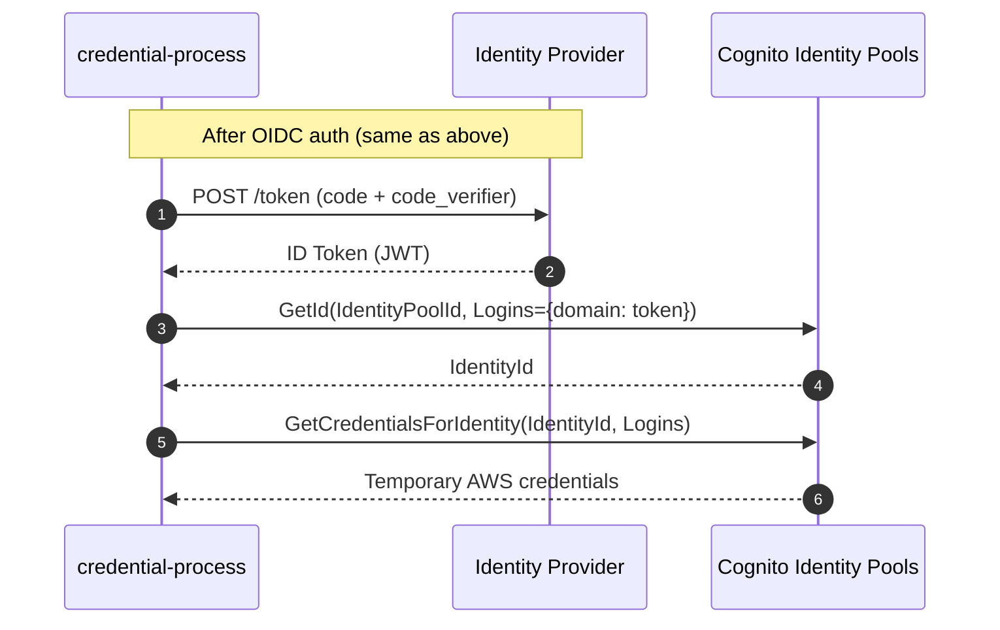

# Credential Helper Architecture

The credential helper (`credential-process`) is a Go binary that implements the [AWS CLI credential_process](https://docs.aws.amazon.com/cli/latest/userguide/cli-configure-sourcing-external.html) protocol. It authenticates users against an enterprise identity provider (IdP) via OIDC, then exchanges the resulting ID token for temporary AWS credentials using either direct IAM federation or Amazon Cognito Identity Pools.

## Overview

```
Developer Machine                       Identity Provider          AWS
+-----------------------+               +----------------+         +----------+
| AWS CLI / Claude Code |               | Okta / Azure / |         | STS /    |
|   credential-process  | <--- OIDC --> | Auth0 / etc.   |         | Cognito  |
+-----------------------+               +----------------+         +----------+
        |                                                               ^
        +----------- ID Token (JWT) -----> Federation -----------------+
        |                                                               |
        +<------------- Temporary AWS Credentials ---------------------+
```

## How It Gets Invoked

The installer configures `~/.aws/config` with a `credential_process` entry:

```ini
[profile ClaudeCode]
credential_process = $HOME/claude-code-with-bedrock/credential-process --profile ClaudeCode
region = ap-southeast-2
```

Whenever the AWS SDK needs credentials (e.g. Claude Code calling Bedrock), it executes the binary. The binary returns JSON to stdout:

```json
{
  "Version": 1,
  "AccessKeyId": "ASIA...",
  "SecretAccessKey": "...",
  "SessionToken": "...",
  "Expiration": "2025-02-14T23:30:00Z"
}
```

## Sequence Diagram

### Full Authentication Flow (Cache Miss)


### Cache Hit Flow (Fast Path)



### Cognito Federation Flow (Alternative)



## Federation Methods

### Direct IAM Federation (Recommended)

Uses `STS.AssumeRoleWithWebIdentity` to exchange the OIDC ID token directly for AWS credentials. This is the lowest-latency option -- a single AWS API call.

- **Config**: `"federation_type": "direct"`
- **Requires**: An IAM OIDC identity provider + IAM role with a trust policy for the IdP
- **CloudFormation**: `deployment/infrastructure/bedrock-auth-okta.yaml`
- **Session duration**: Up to 12 hours (configurable via `max_session_duration`)

### Cognito Identity Pool Federation

Uses Amazon Cognito Identity Pools as an intermediary. Two API calls: `GetId` then `GetCredentialsForIdentity`.

- **Config**: `"federation_type": "cognito"`
- **Requires**: A Cognito Identity Pool configured with the IdP
- **CloudFormation**: `deployment/infrastructure/cognito-identity-pool.yaml`

## Supported Identity Providers

| Provider | Domain Pattern | Auth Endpoint | Token Endpoint |
|----------|---------------|---------------|----------------|
| Okta | `*.okta.com` | `/oauth2/v1/authorize` | `/oauth2/v1/token` |
| Azure AD | `login.microsoftonline.com` | `/oauth2/v2.0/authorize` | `/oauth2/v2.0/token` |
| Auth0 | `*.auth0.com` | `/authorize` | `/oauth/token` |
| JumpCloud | `oauth.id.jumpcloud.com` | `/oauth2/auth` | `/oauth2/token` |
| Cognito | `*.amazoncognito.com` | `/oauth2/authorize` | `/oauth2/token` |

All providers use the OIDC Authorization Code flow with PKCE (no client secret required).

## Configuration

The binary reads `~/claude-code-with-bedrock/config.json`:

```json
{
  "profiles": {
    "ClaudeCode": {
      "provider_domain": "company.okta.com",
      "client_id": "0oa1a2b3c4d5e6f7g8h9",
      "aws_region": "ap-southeast-2",
      "provider_type": "okta",
      "federation_type": "direct",
      "federated_role_arn": "arn:aws:iam::123456789012:role/BedrockOIDCRole",
      "max_session_duration": 43200,
      "credential_storage": "session",
      "quota_api_endpoint": "https://quota-service.example.com"
    }
  }
}
```

| Field | Description |
|-------|-------------|
| `provider_domain` | IdP hostname for OIDC discovery |
| `client_id` | OAuth 2.0 client ID registered with the IdP |
| `aws_region` | AWS region for STS/Cognito calls |
| `provider_type` | One of: `okta`, `azure`, `auth0`, `jumpcloud`, `cognito` |
| `federation_type` | `direct` (STS) or `cognito` (Identity Pools) |
| `federated_role_arn` | IAM role ARN for direct federation |
| `max_session_duration` | Credential lifetime in seconds (max 43200 = 12h) |
| `credential_storage` | `session` to cache in `~/.aws/credentials` |
| `quota_api_endpoint` | Optional URL for token quota checking |

## Concurrency Control

To prevent multiple simultaneous browser auth flows (e.g. parallel terminal sessions), the binary uses TCP port binding as a mutex:

1. Attempt to bind port 8400
2. If the port is already bound, wait (up to 60s) for the other process to finish
3. After the lock is released, re-check the cache -- the other process likely wrote fresh credentials
4. Only proceed with browser auth if cache is still empty

This is implemented in `source/credential-provider-go/locking/portlock.go`.

## Security Properties

- **No client secrets** -- PKCE eliminates the need for a stored client secret
- **No long-lived credentials** -- all credentials are temporary (1h default, 12h max)
- **CSRF protection** -- random `state` parameter validated on callback
- **Replay protection** -- random `nonce` embedded in JWT and validated
- **CloudTrail attribution** -- STS session tags include user email and subject for audit
- **File permissions** -- cached credentials and monitoring tokens are written with `0600`/`0700` permissions

## OTEL Helper Integration

A separate Go binary (`otel-helper`) reads the cached ID token to extract user attributes for OpenTelemetry telemetry:

```
credential-process  -->  ~/.claude-code-session/profile-monitoring.json  -->  otel-helper
                         (encrypted ID token)                                 (extracts claims)
```

The otel-helper outputs HTTP headers (`x-user-email`, `x-user-id`, `x-organization`, etc.) that Claude Code includes in telemetry sent to the OpenTelemetry collector.

## Project Structure

```
source/credential-provider-go/
  main.go                    # Entry point, CLI flags, orchestration
  auth/oauth.go              # OIDC: auth URL construction, token exchange, callback server
  config/config.go           # Profile configuration loading
  provider/provider.go       # Provider-specific endpoint resolution
  federation/
    federation.go            # Routes to direct_sts or cognito
    direct_sts.go            # STS.AssumeRoleWithWebIdentity
    cognito.go               # Cognito GetId + GetCredentialsForIdentity
  credentials/
    output.go                # AWS credential JSON structure
    cache.go                 # Read/write ~/.aws/credentials (INI)
  locking/portlock.go        # TCP port-based concurrency lock
  monitoring/monitoring.go   # Save ID token for otel-helper
  quota/quota.go             # Optional API quota checking
  internal/jwt.go            # JWT decoding (unverified)
```
