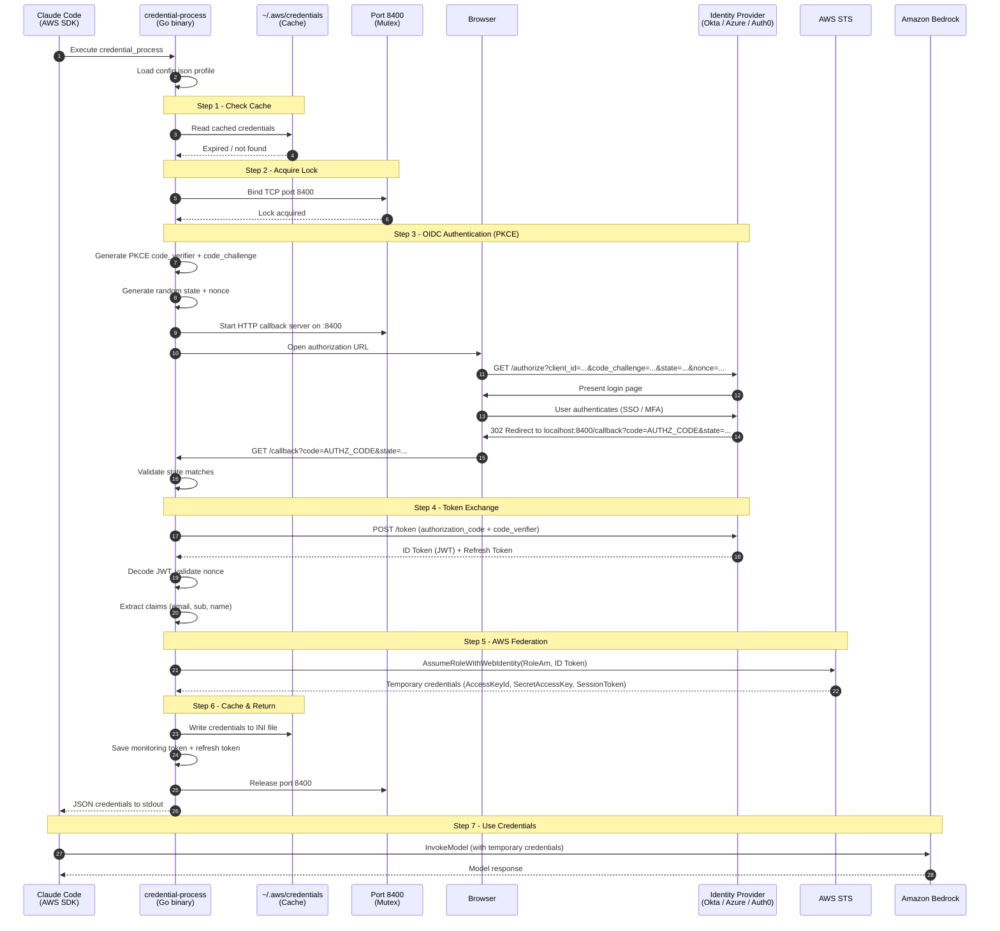
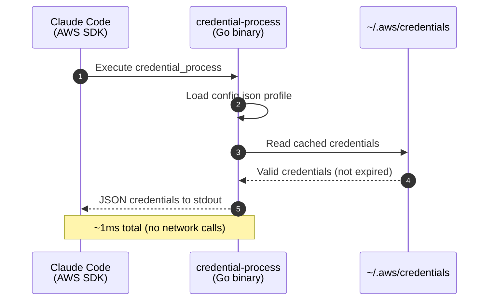
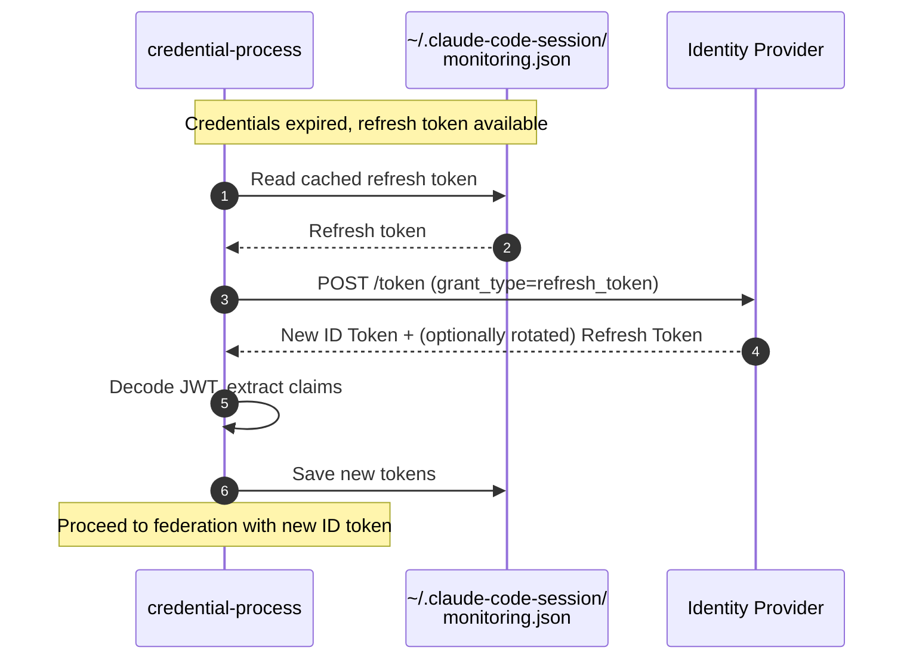
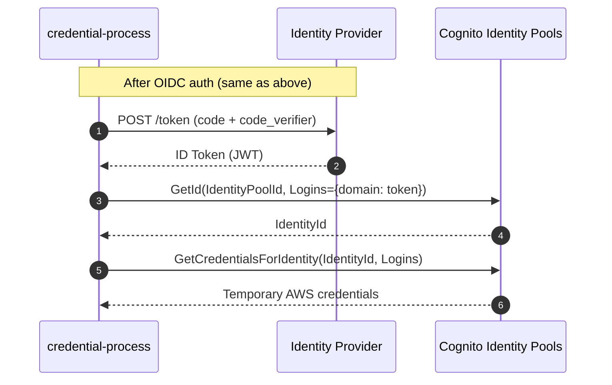

# Credential Helper Architecture

The credential helper (`credential-process`) is a Go binary that implements the [AWS CLI credential_process](https://docs.aws.amazon.com/cli/latest/userguide/cli-configure-sourcing-external.html) protocol. It authenticates users against an enterprise identity provider (IdP) via OIDC, then exchanges the resulting ID token for temporary AWS credentials using either direct IAM federation or Amazon Cognito Identity Pools.

## Overview

```
Developer Machine                       Identity Provider          AWS
+-----------------------+               +----------------+         +----------+
| AWS CLI / Claude Code |               | Okta / Azure / |         | STS /    |
|   credential-process  | <--- OIDC --> | Auth0 / etc.   |         | Cognito  |
+-----------------------+               +----------------+         +----------+
        |                                                               ^
        +----------- ID Token (JWT) -----> Federation -----------------+
        |                                                               |
        +<------------- Temporary AWS Credentials ---------------------+
```

## How It Gets Invoked

The installer configures `~/.aws/config` with a `credential_process` entry:

```ini
[profile ClaudeCode]
credential_process = $HOME/claude-code-with-bedrock/credential-process --profile ClaudeCode
region = ap-southeast-2
```

Whenever the AWS SDK needs credentials (e.g. Claude Code calling Bedrock), it executes the binary. The binary returns JSON to stdout:

```json
{
  "Version": 1,
  "AccessKeyId": "ASIA...",
  "SecretAccessKey": "...",
  "SessionToken": "...",
  "Expiration": "2025-02-14T23:30:00Z"
}
```

## Sequence Diagrams

### Full Authentication Flow (Cache Miss)



### Cache Hit Flow (Fast Path)



### Silent Token Refresh Flow



### Cognito Federation Flow (Alternative)



## Federation Methods

### Direct IAM Federation (Recommended)

Uses `STS.AssumeRoleWithWebIdentity` to exchange the OIDC ID token directly for AWS credentials. This is the lowest-latency option -- a single AWS API call.

- **Config**: `"federation_type": "direct"`
- **Requires**: An IAM OIDC identity provider + IAM role with a trust policy for the IdP
- **CloudFormation**: `deployment/infrastructure/bedrock-auth-okta.yaml`
- **Session duration**: Up to 12 hours (configurable via `max_session_duration`, default 43200s)

STS session names are derived from the user's `sub` claim (truncated to 32 chars) or email prefix, sanitized to AWS-allowed characters (`[\w+=,.@-]`), and prefixed with `claude-code-`.

### Cognito Identity Pool Federation

Uses Amazon Cognito Identity Pools as an intermediary. Two API calls: `GetId` then `GetCredentialsForIdentity`.

- **Config**: `"federation_type": "cognito"`
- **Requires**: A Cognito Identity Pool configured with the IdP
- **CloudFormation**: `deployment/infrastructure/cognito-identity-pool.yaml`
- **Session duration**: Default 28800s (8 hours)

The login key for the Cognito Identity Pool is either extracted from the JWT issuer or constructed from `cognito_user_pool_id` for Cognito User Pool providers. External OIDC providers use `provider_domain` directly.

## Supported Identity Providers

| Provider | Domain Pattern | Auth Endpoint | Token Endpoint | Scopes |
|----------|---------------|---------------|----------------|--------|
| Okta | `*.okta.com` | `/oauth2/v1/authorize` | `/oauth2/v1/token` | `openid profile email offline_access` |
| Azure AD | `*.microsoftonline.com`, `*.windows.net` | `/oauth2/v2.0/authorize` | `/oauth2/v2.0/token` | `openid profile email offline_access` |
| Auth0 | `*.auth0.com` | `/authorize` | `/oauth/token` | `openid profile email offline_access` |
| JumpCloud | `*.jumpcloud.com` | `/oauth2/auth` | `/oauth2/token` | `openid profile email offline_access` |
| Cognito | `*.amazoncognito.com` | `/oauth2/authorize` | `/oauth2/token` | `openid email offline_access` |

All providers use the OIDC Authorization Code flow with PKCE (no client secret required). The `offline_access` scope requests a refresh token for silent renewal.

Azure AD adds `response_mode=query` and `prompt=select_account` to the authorization URL. Cognito omits the `profile` scope.

## Configuration

The binary reads `~/claude-code-with-bedrock/config.json` (or `./config.json` next to the binary):

```json
{
  "profiles": {
    "ClaudeCode": {
      "provider_domain": "company.okta.com",
      "client_id": "0oa1a2b3c4d5e6f7g8h9",
      "aws_region": "ap-southeast-2",
      "provider_type": "okta",
      "federation_type": "direct",
      "federated_role_arn": "arn:aws:iam::123456789012:role/BedrockOIDCRole",
      "max_session_duration": 43200,
      "credential_storage": "session",
      "quota_api_endpoint": "https://quota-service.example.com",
      "quota_check_interval": 30,
      "quota_fail_mode": "open"
    }
  }
}
```

A legacy flat format (`{"ClaudeCode": {...}}` without the `profiles` wrapper) is also supported.

### Provider Configuration

| Field | Description | Default |
|-------|-------------|---------|
| `provider_domain` | IdP hostname for OIDC discovery | _(required)_ |
| `client_id` | OAuth 2.0 client ID registered with the IdP | _(required)_ |
| `aws_region` | AWS region for STS/Cognito calls | `us-east-1` |
| `provider_type` | One of: `auto`, `okta`, `azure`, `auth0`, `jumpcloud`, `cognito` | `auto` (detected from domain) |

### Federation Configuration

| Field | Description |
|-------|-------------|
| `federation_type` | `direct` (STS) or `cognito` (Identity Pools). Auto-detected if not set. |
| `federated_role_arn` | IAM role ARN (required for direct federation) |
| `identity_pool_id` | Cognito Identity Pool ID (required for cognito federation) |
| `cognito_user_pool_id` | Cognito User Pool ID (used for login key construction) |
| `max_session_duration` | Credential lifetime in seconds. Default: 43200 (12h) for direct, 28800 (8h) for Cognito. |
| `credential_storage` | `session` to cache in `~/.aws/credentials` |

### Quota Configuration

| Field | Description | Default |
|-------|-------------|---------|
| `quota_api_endpoint` | URL for quota check API | _(optional, disabled if unset)_ |
| `quota_check_interval` | Minutes between periodic re-checks | `30` |
| `quota_fail_mode` | `open` (warn only) or `closed` (block on exceeded quota) | `open` |
| `quota_check_timeout` | API call timeout in seconds | `5` |

### Legacy Fields

| Field | Maps to |
|-------|---------|
| `okta_domain` | `provider_domain` |
| `okta_client_id` | `client_id` |
| `identity_pool_name` | `identity_pool_id` |

## Silent Token Refresh

The credential process supports silent token renewal using OIDC refresh tokens, avoiding repeated browser authentication:

1. All providers include `offline_access` in their scopes to request a refresh token
2. On first authentication, the refresh token is stored alongside the monitoring token in `~/.claude-code-session/{profile}-monitoring.json`
3. When credentials expire, the binary first attempts a `grant_type=refresh_token` request to the IdP
4. If the IdP rotates the refresh token, the new token replaces the old one
5. If silent refresh fails (token revoked, expired, or not supported), falls back to browser authentication

## Monitoring Token Storage

The credential process saves the JWT ID token for use by the [OTEL Helper](OTEL_HELPER.md):

**Storage location**: `~/.claude-code-session/{profile}-monitoring.json` (permissions `0600`)

```json
{
  "token": "eyJhbGciOiJSUzI1Ni...",
  "refresh_token": "v1.MjQ5YjNiZTgt...",
  "expires": 1708041600,
  "email": "alice@acme.com",
  "profile": "ClaudeCode"
}
```

The `GetMonitoringToken()` function checks the `CLAUDE_CODE_MONITORING_TOKEN` environment variable first, then falls back to the file. A token is considered valid only if it expires more than 10 minutes in the future.

## Quota System

When `quota_api_endpoint` is configured, the credential process checks token quotas before issuing credentials.

### Quota Check Flow

1. On credential issuance, calls `{quota_api_endpoint}/check` with the ID token as a Bearer token
2. The API returns allowed/denied status with usage details (monthly/daily tokens vs limits)
3. **Open mode** (default): quota denial prints a warning but still issues credentials
4. **Closed mode**: quota denial blocks credential issuance with an error message
5. Periodic re-checks occur from cache hits if `quota_check_interval` minutes have elapsed
6. Quota timestamps are cached in `~/.claude-code-session/{profile}-quota-check.json`

### Group-Based Quotas

The quota API can enforce group-level policies. Group claims are extracted from:
- `groups` claim (array or string)
- `cognito:groups` claim (Cognito-specific)
- `custom:department` claim (prefixed as `department:value`)

Usage warnings are shown at 80%+ utilization.

## Concurrency Control

To prevent multiple simultaneous browser auth flows (e.g. parallel terminal sessions), the binary uses TCP port binding as a mutex:

1. Attempt to bind port 8400 (configurable via `REDIRECT_PORT` env var)
2. If the port is already bound, wait (up to 60s) for the other process to finish
3. After the lock is released, re-check the cache -- the other process likely wrote fresh credentials
4. Only proceed with browser auth if cache is still empty

This is implemented in `source/credential-provider-go/locking/portlock.go`.

## Credential Caching

Credentials are cached in `~/.aws/credentials` using INI format:

```ini
[ClaudeCode]
aws_access_key_id = ASIA...
aws_secret_access_key = wJa...
aws_session_token = IQo...
x-expiration = 2025-02-15T12:34:56Z
```

Cached credentials are considered valid only if they expire more than 30 seconds in the future. Writes use atomic temp-file-and-rename to prevent corruption. File permissions are set to `0600`.

## CLI Reference

```
credential-process [--profile NAME] [--get-monitoring-token] [--clear-cache]
                   [--check-expiration] [--refresh-if-needed] [--version]
```

| Flag | Effect |
|------|--------|
| `--profile`, `-p` | Configuration profile name (falls back to `CCWB_PROFILE` env, auto-detect, then `ClaudeCode`) |
| `--get-monitoring-token` | Return the cached monitoring JWT token; triggers authentication if none cached |
| `--clear-cache` | Remove cached credentials for the given profile |
| `--check-expiration` | Exit 1 if credentials are expired/missing, exit 0 if valid |
| `--refresh-if-needed` | Refresh credentials if expired (session storage mode only) |
| `--version`, `-v` | Print version and exit |

In normal operation (no special flags), the credential process performs OIDC authentication and outputs AWS credentials as JSON to stdout.

## Environment Variables

| Variable | Purpose | Default |
|----------|---------|---------|
| `CCWB_PROFILE` | Profile name (alternative to `--profile` flag) | `ClaudeCode` |
| `REDIRECT_PORT` | Override OAuth callback port | `8400` |
| `DEBUG_MODE` | Enable debug logging (`true`, `1`, `yes`, `y` -- case-insensitive) | disabled |
| `CREDENTIAL_PROCESS_LOG_FILE` | Redirect debug logs to file. Debug messages go to file only; status/error messages go to both stderr and file. | stderr |
| `CLAUDE_CODE_MONITORING_TOKEN` | JWT monitoring token (set by credential process on successful auth, read by OTEL Helper) | _(unset)_ |

## Security Properties

- **No client secrets** -- PKCE eliminates the need for a stored client secret
- **No long-lived credentials** -- all credentials are temporary (1h default, 12h max)
- **CSRF protection** -- random `state` parameter validated on callback
- **Replay protection** -- random `nonce` embedded in JWT and validated
- **CloudTrail attribution** -- STS session tags include user email and subject for audit
- **File permissions** -- cached credentials and monitoring tokens are written with `0600`/`0700` permissions
- **Environment isolation** -- AWS environment variables (`AWS_PROFILE`, `AWS_ACCESS_KEY_ID`, etc.) are cleared before federation calls and restored afterward to prevent recursive credential resolution
- **Atomic writes** -- credential cache uses temp file + rename to prevent file corruption

## OTEL Helper Integration

A separate Go binary (`otel-helper`) reads the cached ID token to extract user attributes for OpenTelemetry telemetry. See [OTEL Helper documentation](OTEL_HELPER.md) for details.

```
credential-process  -->  ~/.claude-code-session/{profile}-monitoring.json  -->  otel-helper
                         (ID token + refresh token)                              (extracts claims)
```

The otel-helper outputs HTTP headers (`x-user-email`, `x-user-id`, `x-organization`, etc.) that Claude Code includes in telemetry sent to the OpenTelemetry collector.

## Project Structure

```
source/credential-provider-go/
  main.go                    # Entry point, CLI flags, orchestration
  auth/oauth.go              # OIDC: auth URL construction, token exchange, callback server, refresh
  config/config.go           # Profile configuration loading (new + legacy formats)
  provider/provider.go       # Provider-specific endpoint resolution
  federation/
    federation.go            # Routes to direct_sts or cognito
    direct_sts.go            # STS.AssumeRoleWithWebIdentity
    cognito.go               # Cognito GetId + GetCredentialsForIdentity
  credentials/
    output.go                # AWS credential JSON structure
    cache.go                 # Read/write ~/.aws/credentials (INI), atomic writes
  locking/portlock.go        # TCP port-based concurrency lock
  monitoring/monitoring.go   # Save/retrieve ID token, refresh token, expiry
  quota/
    quota.go                 # Quota API integration and periodic re-checks
    display.go               # Quota warning/blocking display formatting
  internal/
    jwt.go                   # JWT decoding (unverified)
    debug.go                 # Debug logging, log file management
```
